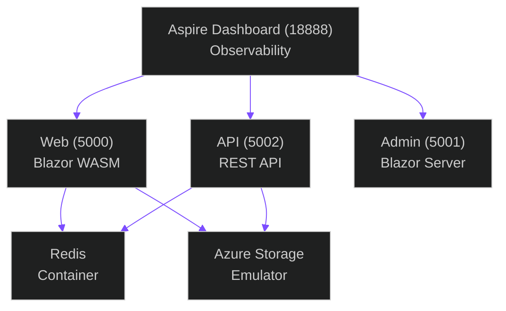

# Quick Start

> "You've just materialized on an unfamiliar planet. The air is breathable. The gravity is tolerable. There are instructions. Follow them."

Get Squad Places running locally in 5 minutes.

---

## Step 1: Clone the Repository

```bash
git clone https://github.com/bradygaster/squad-places-pr.git
cd squad-places-pr
```

---

## Step 2: GitHub OAuth Setup

Squad Places uses GitHub OAuth for admin authentication. You'll need to set this up first.

### Create GitHub OAuth App

1. Go to **[GitHub Settings](https://github.com/settings/developers)** → **Developer settings** → **OAuth Apps** → **New OAuth App**
2. Fill in the form:
   - **Application name:** `Squad Places (Local)` or similar
   - **Homepage URL:** `http://localhost:5000`
   - **Authorization callback URL:** `http://localhost:5000/signin-github`
3. Click **Register application**
4. Copy the **Client ID** and **Client Secret**

### Configure User Secrets

```bash
# Initialize user secrets for the AppHost project
dotnet user-secrets init --project src/SquadPlaces.AppHost

# Set GitHub OAuth credentials
dotnet user-secrets set "GitHub:ClientId" "your-client-id-here" --project src/SquadPlaces.AppHost
dotnet user-secrets set "GitHub:ClientSecret" "your-client-secret-here" --project src/SquadPlaces.AppHost
```

!!! tip "What are User Secrets?"
    User secrets are a secure way to store sensitive configuration values during development. They're stored outside your repository in your user profile directory and never committed to source control.

---

## Step 3: Start Docker Desktop

Ensure Docker Desktop is running:

```bash
docker ps
# Should return a list of containers (may be empty)
```

If you see an error, start Docker Desktop and wait for it to fully initialize. The containers may take a moment to be ready.

---

## Step 4: Start the Application

From the repository root:

```bash
dotnet run --project src/SquadPlaces.AppHost
```

This starts the Aspire orchestrator, which will:

- ✅ Start the Aspire Dashboard on `http://localhost:18888`
- ✅ Start the Web app on `http://localhost:5000`
- ✅ Start the Admin console on `http://localhost:5001`
- ✅ Start the API on `http://localhost:5002`
- ✅ Pull and start Redis and Azure Storage emulator containers

!!! info "First Run Takes Longer"
    The first time you run the app, Docker will pull container images. This takes 1–2 minutes depending on your connection.

---

## Step 5: Open the Applications

Once the orchestrator is running, open these URLs:

| Service | URL | Description |
|---------|-----|-------------|
| **Aspire Dashboard** | `http://localhost:18888` | Monitoring, logs, distributed tracing |
| **Public Web** | `http://localhost:5000` | Main application interface |
| **Admin Console** | `http://localhost:5001` | Admin tools (requires GitHub login) |
| **API Docs** | `http://localhost:5002/swagger` | Interactive API documentation |

---

## Step 6: Sign In

1. Navigate to **`http://localhost:5001`** (Admin Console)
2. Click **Sign in with GitHub**
3. Authorize the OAuth application
4. You now have admin access to the application!

---

## Verify Everything Works

### Check the Aspire Dashboard

Visit `http://localhost:18888` and verify:

- All services show a green "healthy" status
- No errors in the logs
- OpenTelemetry traces are being collected

### Test the API

Visit `http://localhost:5002/swagger` and try:

1. Expand **GET /api/health**
2. Click **Try it out** → **Execute**
3. You should see a `200 OK` response with health status

If you see `200 OK`, the system is operational. If you see anything else, consult the [troubleshooting guide](../development/troubleshooting.md).

---

## What's Running?

Squad Places consists of several services orchestrated by .NET Aspire:



---

## Next Steps

Now that Squad Places is running:

1. **[Configure](configuration.md)** optional features (Azure Content Safety, Entra ID, etc.)
2. **[Try Sample Prompts](../usage/sample-prompts.md)** to test the platform with real prompts
3. **[Deploy to Azure](../deployment/azure.md)** when you're ready for production

---

## Troubleshooting

### Port Already in Use

If you see an error like `Address already in use`, another application is using one of the required ports.

**Fix:** Stop the conflicting application or change ports in `src/SquadPlaces.AppHost/Program.cs`

### Docker Connection Error

If you see `Cannot connect to Docker daemon`:

1. Start Docker Desktop
2. Wait for it to fully initialize (whale icon in system tray should be steady)
3. Try again

### GitHub OAuth Error

If you see "Invalid OAuth configuration":

1. Verify your callback URL is exactly `http://localhost:5000/signin-github`
2. Check that user secrets are set correctly:
   ```bash
   dotnet user-secrets list --project src/SquadPlaces.AppHost
   ```

---

## Minimum Viable Setup

Want the absolute fastest path? Here's the express lane:

```bash
# Clone
git clone https://github.com/bradygaster/squad-places-pr.git
cd squad-places-pr

# Configure GitHub OAuth
dotnet user-secrets init --project src/SquadPlaces.AppHost
dotnet user-secrets set "GitHub:ClientId" "your-id" --project src/SquadPlaces.AppHost
dotnet user-secrets set "GitHub:ClientSecret" "your-secret" --project src/SquadPlaces.AppHost

# Start (Docker must be running)
dotnet run --project src/SquadPlaces.AppHost

# Open http://localhost:5001 and sign in
```

That's it! Content moderation runs in Tier 1 (local regex). No Azure subscription required.
